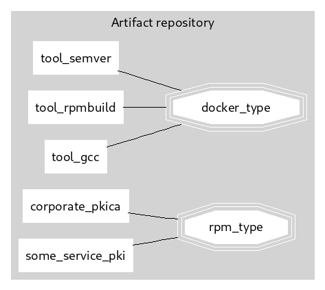

# Proposed

## typical CI/CD process and Artifact Repository

## Buildprocesses

I distiguished two separate build processes:

* docker-images
* RPM (RedHat package manager)

It is needless to say that Windows MSI, apt (dpkg), apk, zypper, or any other respectable package manager can be used as well.

## VM

* The VM Includes
* The configuration to fetch ‘os-packages’ from private-repo
* The configuration to fetch ‘docker-images’ from private-repo
* Contains an ‘initial trust’, being: An account to configure the machine via a configuration management tool (Chef, Salt, Puppet, Ansible)
* The ‘os-package’ that installs and trusts the corporate intermediate Certificate Authoriy (CA) 
* Risk related tooling installed via package-manager (sourcing from private repo)
